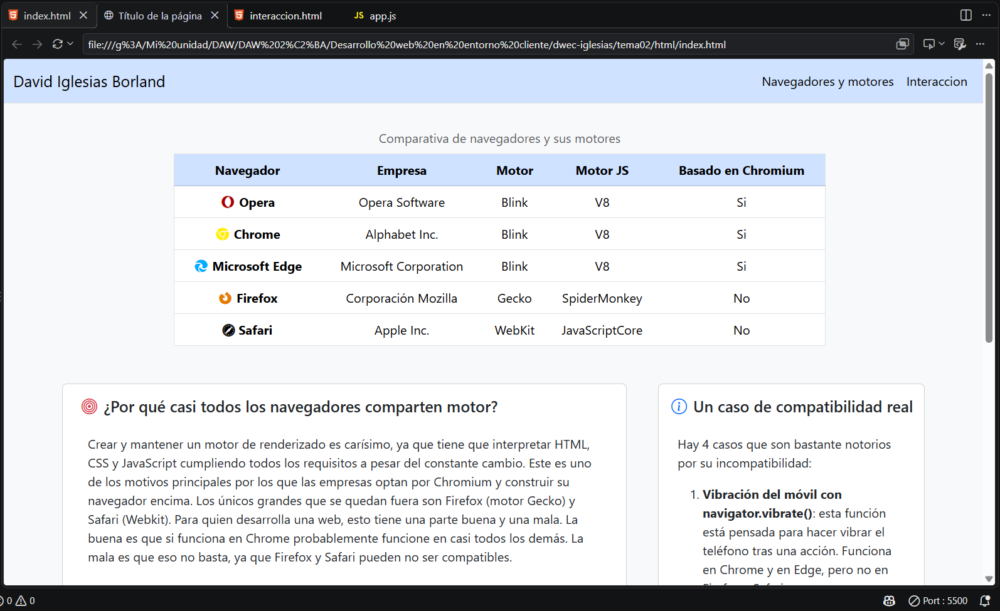
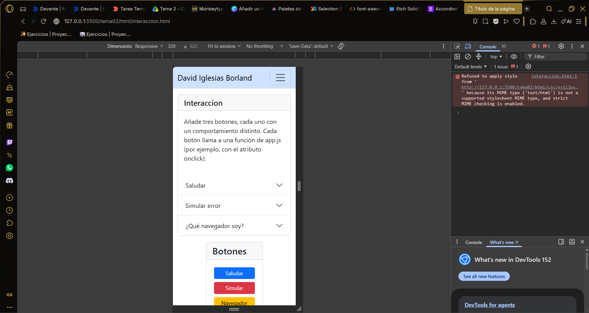
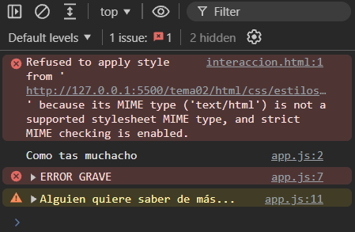
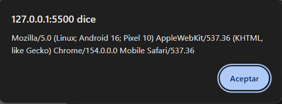
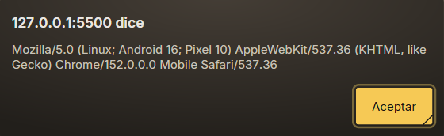
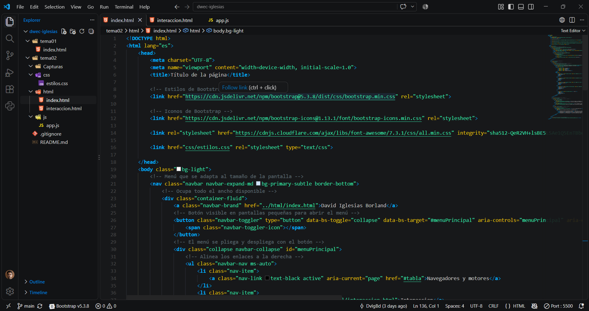
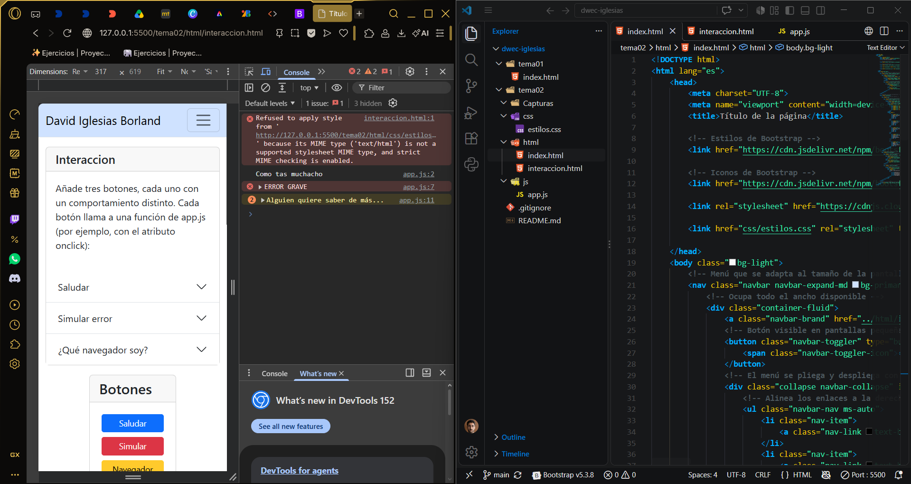

# Tema 02 · Navegadores, motores y primera página interactiva

Pequeño sitio web de dos páginas construido con **Bootstrap 5** y **JavaScript**. La primera página compara los principales navegadores y sus motores; la segunda añade interacción mediante botones que muestran mensajes con `alert()` y dejan trazas en la consola del navegador.

**Autor:** David Iglesias Borland

---

## Estructura del proyecto

```
tema02/
├── Capturas/              # Capturas del funcionamiento
├── css/
│   └── estilos.css        # Estilos propios (complementan a Bootstrap)
├── html/
│   ├── index.html         # Página 1: navegadores y motores
│   └── interaccion.html   # Página 2: interacción con JavaScript
├── js/
│   └── app.js             # Funciones que ejecutan los botones
└── README.md
```

Cada tipo de archivo tiene su propia carpeta: el HTML define la estructura, el CSS la apariencia y el JavaScript el comportamiento. Las dos páginas comparten la misma barra de navegación, con el nombre del autor y un enlace a cada página.

| Página | Contenido |
|---|---|
| `index.html` | Tabla comparativa de navegadores, explicación de por qué casi todos comparten motor, en qué navegadores probar una web y casos reales de incompatibilidad. |
| `interaccion.html` | Acordeón que explica qué hace cada botón y una tarjeta con los botones que llaman a `app.js`. |

---

## Uso de Bootstrap

### Carga desde CDN

Ambas páginas incluyen la etiqueta `viewport` y cargan Bootstrap desde jsDelivr: el CSS en el `<head>` y el `bootstrap.bundle.min.js` al final del `<body>`, necesario para que funcionen el menú plegable y el acordeón. También se cargan Bootstrap Icons y, en `index.html`, Font Awesome desde cdnjs para los logotipos de los navegadores. `estilos.css` se enlaza después de Bootstrap para que sus reglas puedan sobrescribir las del framework.

```html
<meta name="viewport" content="width=device-width, initial-scale=1.0">
<link href="https://cdn.jsdelivr.net/npm/bootstrap@5.3.8/dist/css/bootstrap.min.css" rel="stylesheet">
<link href="https://cdn.jsdelivr.net/npm/bootstrap-icons@1.13.1/font/bootstrap-icons.min.css" rel="stylesheet">
<!-- ... -->
<script src="https://cdn.jsdelivr.net/npm/bootstrap@5.3.8/dist/js/bootstrap.bundle.min.js"></script>
```

### Barra de navegación (común a las dos páginas)

- `navbar navbar-expand-md`: el menú se muestra completo desde pantallas medianas y se pliega en el móvil.
- `navbar-toggler` + `collapse navbar-collapse`: el botón hamburguesa despliega el menú gracias a `data-bs-toggle="collapse"` y `data-bs-target="#menuPrincipal"`.
- `ms-auto` empuja los enlaces a la derecha, y `active` con `aria-current="page"` marca la página en la que estás.
- `bg-primary-subtle` y `border-bottom` le dan el fondo azul suave y la línea inferior.

### Rejilla

El contenido se organiza con `.container`, `.row` y `.col-*`. En `index.html` la zona de texto se reparte con `col-12 col-md-8` y `col-12 col-md-4`: en el móvil cada bloque ocupa todo el ancho y se apilan, y a partir de `md` quedan en dos columnas (8 + 4). Así la página se adapta sin necesidad de scroll horizontal.

### Componentes en `index.html`

- **Tabla:** `table`, `table-hover` (resalta la fila al pasar el ratón), `table-primary` en el encabezado, `caption-top` para el título y `align-middle text-center` para centrar el contenido. Está envuelta en `table-responsive`, de modo que en pantallas estrechas se desplaza dentro de su contenedor sin romper la página.
- **Cards:** las dos explicaciones son tarjetas `card`, y los casos de compatibilidad van en un `<aside class="card">` en la columna lateral.
- **Iconos:** Font Awesome (`fa-chrome`, `fa-opera`, `fa-edge`, `fa-firefox-browser`) para los navegadores, y Bootstrap Icons (`bi-browser-safari`, `bi-bullseye`, `bi-patch-question-fill`, `bi-info-circle`) para Safari y los títulos de las tarjetas.
- **Utilidades:** márgenes y rellenos (`m-2`, `p-3`), colores de texto (`text-danger`, `text-primary`) y `bg-light` en el `body`.

### Componentes en `interaccion.html`

- **Card con acordeón:** una `card` con `card-header` que contiene un `accordion accordion-flush`. Cada apartado explica un botón, y `data-bs-parent` hace que solo haya uno abierto a la vez.
- **Card de botones:** `btn-primary`, `btn-danger` y `btn-warning` dan a cada botón un color acorde a su función, y `d-flex flex-column justify-content-center` los apila y centra.
- **Agrupación:** `card-group d-flex flex-column align-items-center` coloca ambas tarjetas una debajo de otra y centradas.

### CSS propio

`estilos.css` solo define la clase `.texto-justificado`, que justifica el texto de las tarjetas y activa `hyphens: auto` para que el navegador parta palabras con guion y no queden huecos grandes entre ellas.

---

## Uso de JavaScript

Todo el código está en `js/app.js`, enlazado al final del `body` de `interaccion.html`, después del bundle de Bootstrap. En el HTML no hay ningún bloque `<script>` con código: cada botón llama a su función mediante el atributo `onclick`.

| Botón | Función | Qué ve el usuario | Traza en consola |
|---|---|---|---|
| Saludar | `saludar()` | Un `alert()` con un saludo | `console.log()` |
| Simular | `simularError()` | Nada | `console.error()` |
| Navegador | `queSoy()` | Un `alert()` con `navigator.userAgent` | `console.warn()` |

El botón «Simular» es útil para entender la diferencia entre usuario y desarrollador: quien usa la página no nota nada, pero el error queda registrado en la consola y se puede consultar desde las DevTools.

---

## Quién hace qué: el botón «Saludar»

```html
<button type="button" class="btn btn-primary m-1" onclick="saludar()">Saludar</button>
```

- **HTML:** crea el elemento `<button>`, su texto y el atributo `onclick` que conecta el clic con la función.
- **Bootstrap (CSS):** `btn` aporta el relleno, los bordes redondeados y los efectos al pasar el ratón o pulsar; `btn-primary` el color azul y `m-1` la separación con los demás botones.
- **JavaScript:** al hacer clic se ejecuta `saludar()`, que deja una traza con `console.log()` y muestra la ventana con `alert()`.

---

## Comparación de userAgent

Las pruebas se hicieron en Chrome y en Opera GX, ambos en modo dispositivo simulando un Pixel 10:

```
Chrome:   Mozilla/5.0 (Linux; Android 16; Pixel 10) AppleWebKit/537.36 (KHTML, like Gecko) Chrome/154.0.0.0 Mobile Safari/537.36
Opera GX: Mozilla/5.0 (Linux; Android 16; Pixel 10) AppleWebKit/537.36 (KHTML, like Gecko) Chrome/152.0.0.0 Mobile Safari/537.36
```

Se reconocen el sistema y el dispositivo simulados (`Linux; Android 16; Pixel 10`), la palabra `Mobile` y la versión de Chromium. Esa versión es la única diferencia: Opera se basa en un Chromium algo anterior (152 frente a 154). Opera suele añadir `OPR/...` al final, pero al simular un dispositivo las DevTools sustituyen el userAgent por el del móvil emulado y esa marca desaparece.

Las palabras `Mozilla`, `AppleWebKit` y `Safari` son herencia histórica. Muchas webs antiguas solo servían el contenido completo a navegadores que se identificaban como «Mozilla» (Netscape), así que todos lo incluyeron. Chrome nació sobre WebKit, el motor de Safari (derivado a su vez de KHTML), y aunque en 2013 lo separó como Blink, mantiene esas marcas para que las webs que las buscan le sigan tratando como un navegador moderno. Por eso el userAgent no es una forma fiable de saber qué navegador se está usando.

---

## Capturas

### `index.html` en el ordenador



Página principal con el nombre visible en la navbar y el menú en horizontal. Se ve la tabla con el icono de cada navegador y las tarjetas repartidas en dos columnas.

### `interaccion.html` en modo móvil



Modo dispositivo de las DevTools a 320 px de ancho. La navbar se pliega en el botón hamburguesa y las tarjetas ocupan todo el ancho sin scroll horizontal.

### Trazas en la consola



Consola tras pulsar los tres botones: el `log` de «Saludar», el `error` de «Simular» y el `warn` de «Navegador», cada uno con la línea de `app.js` que lo genera.

### `alert()` del botón «¿Qué navegador soy?»



Chrome mostrando su userAgent en modo dispositivo.



Opera GX mostrando el suyo; solo cambia la versión de Chromium.

### Entorno de trabajo



VS Code con el repositorio abierto y `index.html` en el editor. En la barra de estado aparece `Port: 5500`, que indica que Live Server está en marcha.



Opera GX con las DevTools en modo móvil y las trazas en consola, junto a VS Code, sirviendo la página desde `127.0.0.1:5500`.

---

## Créditos

- **README:** redactado con la ayuda de Claude (Anthropic).
- **Comentarios del código:** generados con GitHub Copilot.
- **Bootstrap 5.3.8** y **Bootstrap Icons 1.13.1**, cargados desde jsDelivr: [getbootstrap.com](https://getbootstrap.com) · [icons.getbootstrap.com](https://icons.getbootstrap.com)
- **Font Awesome 7.3.1**, cargado desde cdnjs: [fontawesome.com](https://fontawesome.com) · [cdnjs.com](https://cdnjs.com/libraries/font-awesome)