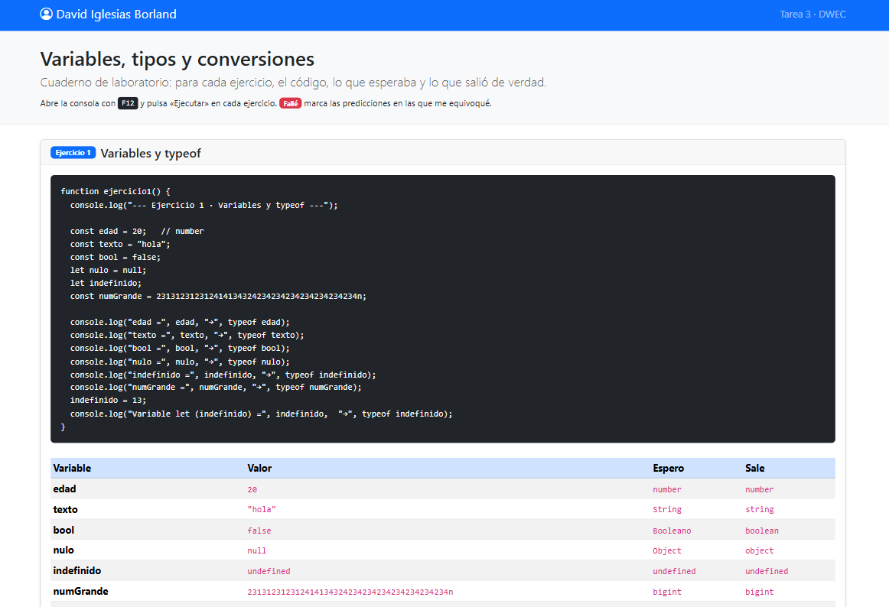
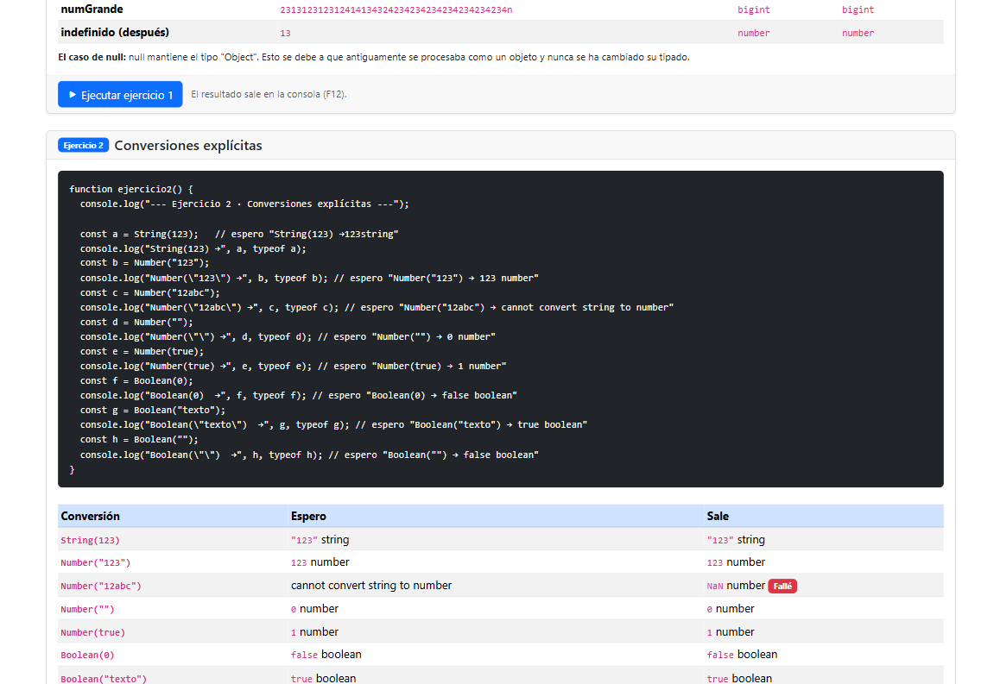
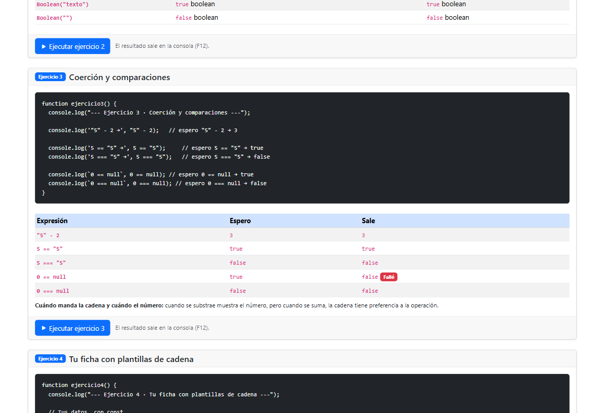
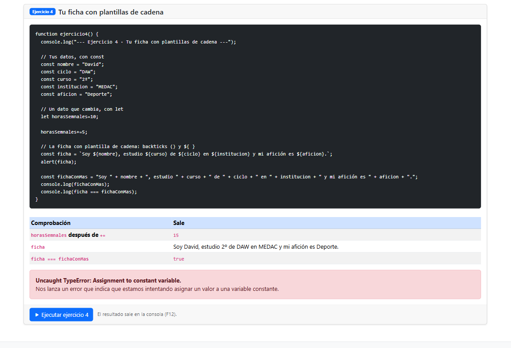
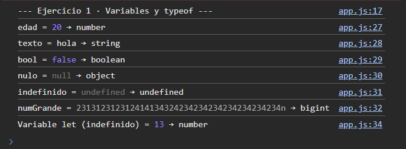
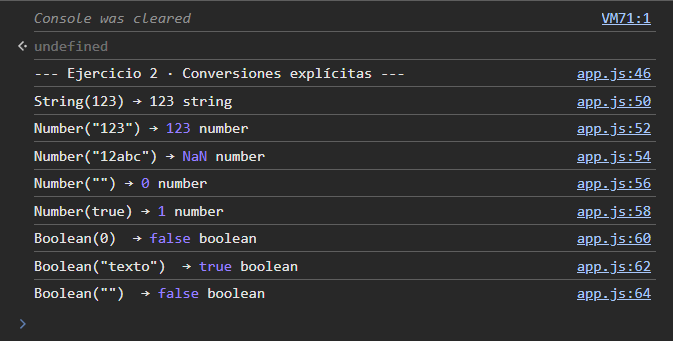
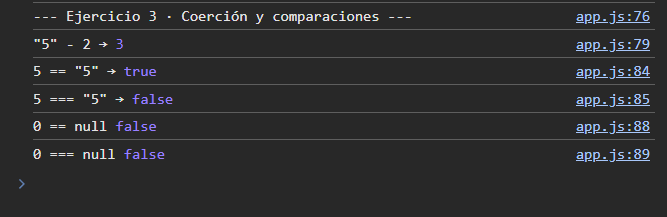
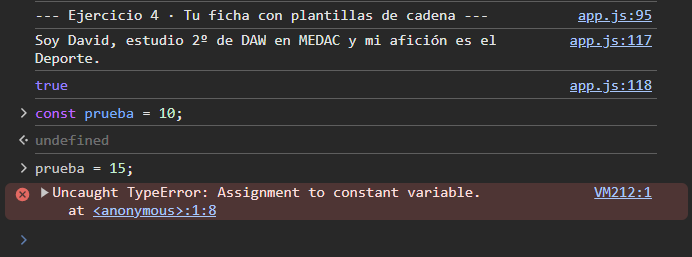

# Tarea 3 · Variables, tipos y conversiones

| | |
|---|---|
| **Autor** | David Iglesias Borland |
| **Módulo** | Desarrollo Web en Entorno Cliente (DWEC) |
| **Curso** | 2.º DAW · 2026-27 |

---

## Índice

1. [Descripción](#descripción)
2. [Vista general](#vista-general)
3. [Ejercicios](#ejercicios)
   - [Ejercicio 1 · Tipos de variables](#ejercicio-1--tipos-de-variables)
   - [Ejercicio 2 · Funciones de conversión](#ejercicio-2--funciones-de-conversión)
   - [Ejercicio 3 · Operadores con distintos tipos](#ejercicio-3--operadores-con-distintos-tipos)
   - [Ejercicio 4 · Ficha personal y constantes](#ejercicio-4--ficha-personal-y-constantes)
4. [Reflexión](#reflexión)
5. [Uso de IA](#uso-de-ia)
6. [Fuentes](#fuentes)

---

## Descripción

Práctica centrada en los tipos de datos de JavaScript, las funciones nativas de conversión y el comportamiento de los operadores cuando se combinan valores de distinto tipo. La página está maquetada con Bootstrap y cada ejercicio se presenta en su propia card, junto con mis predicciones y los fallos marcados.

---

## Vista general

En la navbar aparece mi nombre, y debajo se muestran las cuatro cards con los fallos de predicción marcados.

<table>
  <tr>
    <td></td>
    <td></td>
  </tr>
  <tr>
    <td></td>
    <td></td>
  </tr>
</table>

---

## Ejercicios

### Ejercicio 1 · Tipos de variables

**Objetivo:** comprobar el tipo de cada variable con `typeof`.

**Resultado:** la consola muestra el tipo de cada variable. Una variable declarada con `let` sin valor es de tipo `undefined`, y al asignarle un número su tipo pasa a ser `number`.

### Ejercicio 2 · Funciones de conversión

**Objetivo:** usar las funciones nativas de conversión y predecir qué valor y qué tipo devuelve cada una.

**Resultado:** fallé una predicción. Esperaba que convertir un texto no numérico lanzara un `TypeError`, pero JavaScript devuelve `NaN` (que, curiosamente, es de tipo `number`).

### Ejercicio 3 · Operadores con distintos tipos

**Objetivo:** observar cómo se comportan los operadores aritméticos cuando se mezclan tipos.

**Resultado:**
- Con `+`, si uno de los operandos es un `string`, JavaScript **concatena**.
- Con `-`, como no se puede restar texto, JavaScript **convierte a número** y devuelve un `number`.

### Ejercicio 4 · Ficha personal y constantes

**Objetivo:** mostrar una ficha personal con `alert` y provocar un error reasignando una constante.

**Resultado:** se muestra la ficha ("Soy David, …") y, al intentar cambiar el valor de la `const`, la consola lanza un `TypeError: Assignment to constant variable`.

---

## Reflexión

Estos ejercicios sirven para afianzar el tipado de variables y las funciones nativas de conversión. En general las conversiones son intuitivas, pero hay casos que no lo son tanto. Por ejemplo, convertir un texto con caracteres alfabéticos devuelve `NaN` y no un error, como yo había supuesto erróneamente.

Además, no solo se aprende a cambiar el tipo de un valor, sino también qué resultados se obtienen al operar y comparar valores de tipos distintos. Esto es clave para evitar errores silenciosos en JavaScript.

---

## Uso de IA

La estructura, el formato y la revisión ortográfica de este README se hicieron con ayuda de **Claude** (Anthropic), a partir de mi redacción original.

---

## Fuentes

- [Documentación de Bootstrap](https://getbootstrap.com/docs/)
- [W3Schools · Bootstrap 5](https://www.w3schools.com/bootstrap5)
- [MDN Web Docs · Tipos de datos en JavaScript](https://developer.mozilla.org/es/docs/Web/JavaScript/Data_structures)